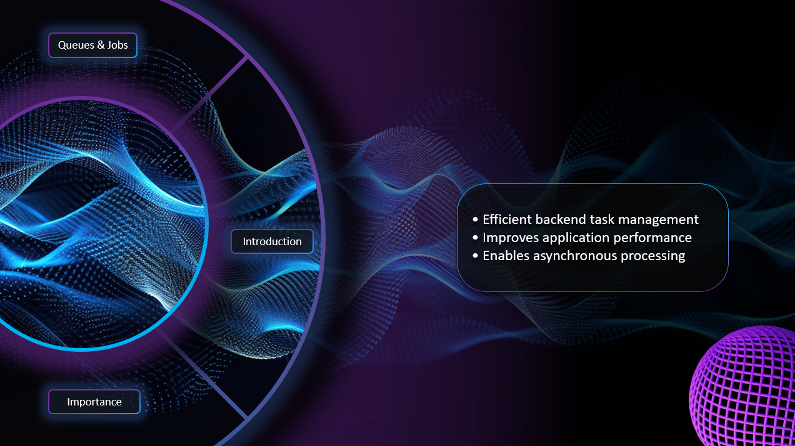
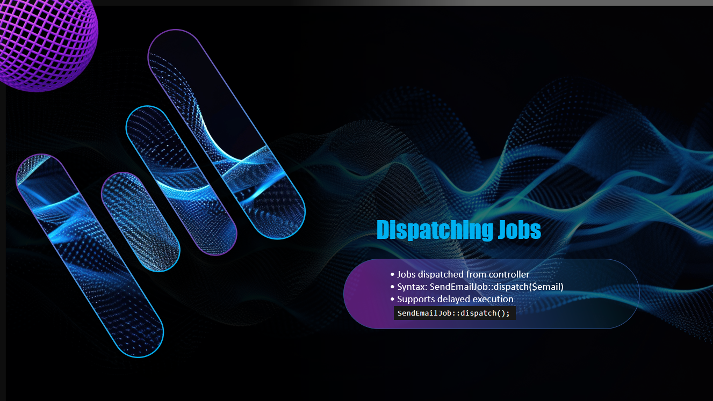
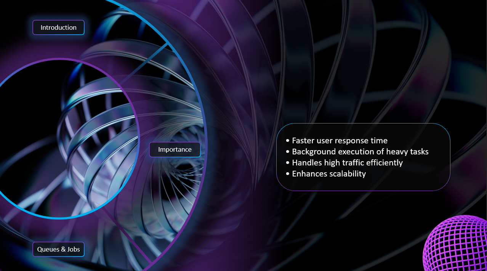
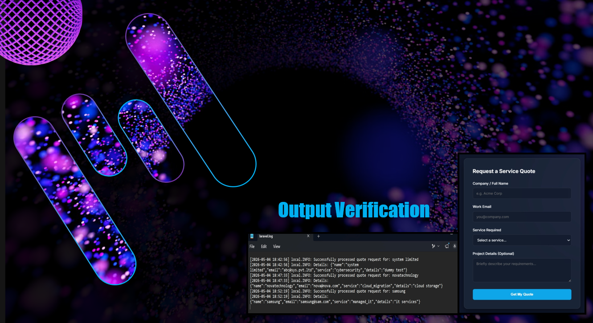
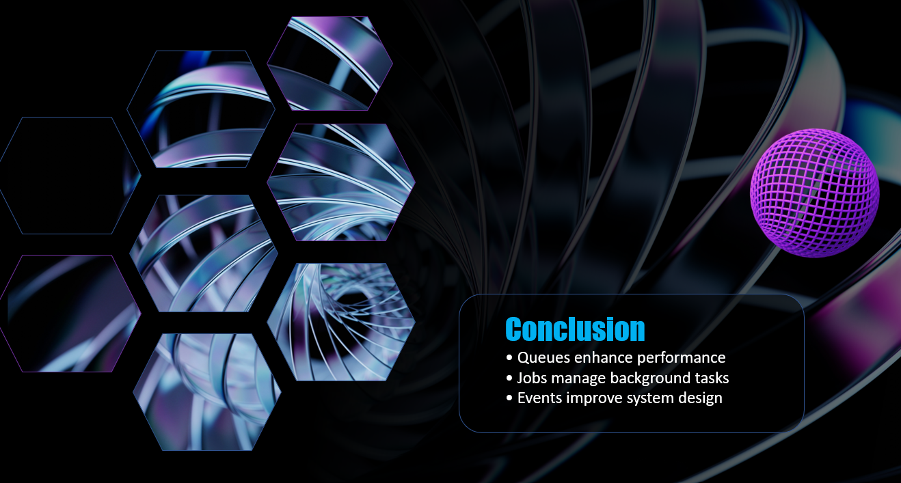

# Modern Futuristic Web Presentation
### Designed by Abdullah Irfan

A premium, highly stylish, and modern presentation design crafted to showcase advanced UI/UX layout techniques within presentation software.

---

## 💎 Key Features

* **100% Hand-Crafted Layouts:** Created entirely from scratch using native presentation tools—**absolutely no AI generation tools** were used.
* **Seamless Morph Transitions:** Utilizes advanced cinematic Morph transitions to deliver a fluid, application-like user experience.
* **Glassmorphism Aesthetic:** Designed with a futuristic vibe featuring sleek transparent boxes, refined typography, and a modern color palette.

---

## 📦 Repository Contents

> 🛑 **Note:** The original source `.pptx` file is not included in this repository to protect the design assets from being copied. 

Instead, the following presentation formats are available for review:
1. **`presentation web.pdf`** – Download this file to inspect the static typography, alignment, transparent boxes, and overall design layouts.
2. **`demonstration.mp4`** – Watch the embedded video below to see the modern Morph transitions and animations in action.

---

## 📸 Interface Preview

  
  
   
   
   
   

---

© 2026 Abdullah Irfan. All rights reserved.
